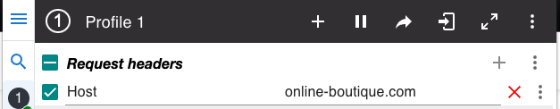
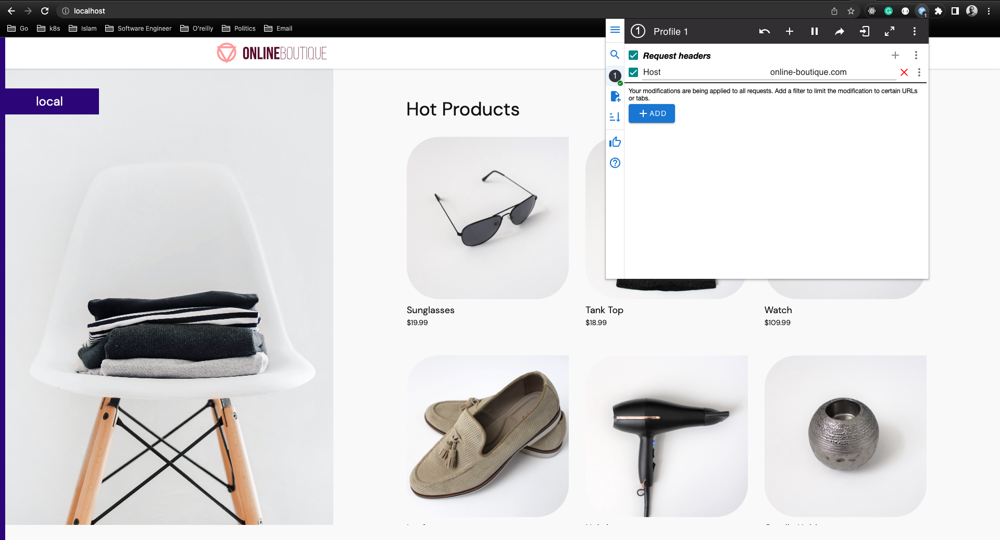

# Exposing Your Application On An HTTP Port

## Configure Istio Ingress Gateway
### Check that the service type of `istio-ingressgateway` is LoadBalancer

```
kubectl -n istio-system get svc istio-ingressgateway -o=jsonpath='{.spec.type}' json
```
```
LoadBalancer
```

### Make sure  `istio-ingressgateway` service has external ip
```
kubectl -n istio-system get svc istio-ingressgateway 
```
```
NAME                   TYPE           CLUSTER-IP     EXTERNAL-IP   PORT(S)                                                                      AGE
istio-ingressgateway   LoadBalancer   10.111.92.36   127.0.0.1     15021:30135/TCP,80:31649/TCP,443:31448/TCP,31400:30259/TCP,15443:32734/TCP   8h
```

### Export external IP of istio-ingressgateway service
```
export INGRESS_IP=$(kubectl -n istio-system get svc istio-ingressgateway -o=jsonpath='{.status.loadBalancer.ingress[0].ip}')
```
```
echo $echo $INGRESS_IP
127.0.0.1
```

### Create Istio gateway configuration

```
apiVersion: networking.istio.io/v1beta1
kind: Gateway
metadata:
  name: frontend-gateway
  namespace: online-boutique
spec:
  selector:
    istio: ingressgateway
  servers:
    - port:
        number: 80
        name: http
        protocol: HTTP
      hosts:
      - "online-boutique.com"
```

### Create Virtual Service configuration
```
apiVersion: networking.istio.io/v1alpha3
kind: VirtualService
metadata:
  name: frontend-virtual-service
  namespace: online-boutique
spec:
  hosts:
  - "*"
  gateways:
  - frontend-gateway
  http:
  - route:
    - destination:
        host: frontend
        port:
          number: 80
```

### Install mod header plugin on your browser

```
https://chrome.google.com/webstore/detail/modheader-modify-http-hea/idgpnmonknjnojddfkpgkljpfnnfcklj
```

### Open browser and set host header


### Put INGRESS IP on the browser

